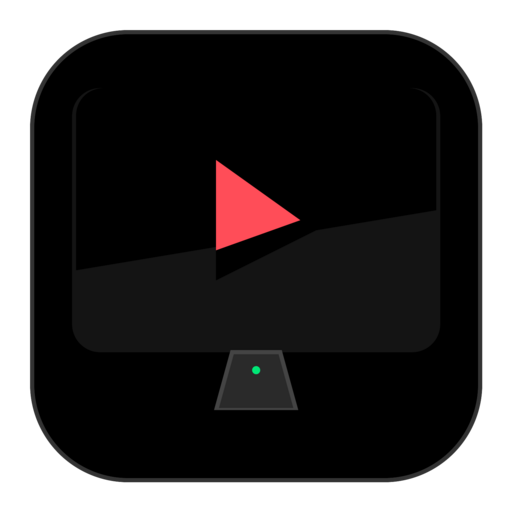

# FlixDesk 🎬

<div align="center">
  
  <h3>Modern, Feature-Rich Netflix Desktop Client for Linux</h3>
  <p>Tailored for Pop!_OS COSMIC, GNOME, KDE, and modern Wayland/X11 desktops.</p>
</div>

---

## 🌟 Key Features

- **🐧 Linux MPRIS D-Bus Integration:** Control playback using your keyboard media keys, GNOME top bar quick settings, COSMIC media applet, KDE plasma widgets, and lock screen controls.
- **🛡️ Widevine DRM Loading:** Automatic discovery and configuration of Google Widevine CDM across Chrome, Chromium, Brave, Flatpak runtime, and system packages.
- **⚡ 1080p Stream Unlock:** Bypasses Netflix's standard 720p throttle on Linux, enforcing 1080p AVC/H.264 high-bitrate (~5800 kbps) streaming profiles.
- **⏭️ Smart Auto-Skip:** Automatically skips opening intro sequences, recaps, and seamlessly advances to the next episode.
- **🖼️ Picture-in-Picture (PiP):** Floating, resizable window to keep watching while multitasking.
- **🔔 System Tray Integration:** Minimize to tray with quick playback actions (Play/Pause, Skip, Mute, Preferences).
- **🎮 Discord Rich Presence:** Automatically displays what you are watching (Show title, Episode name, season) on your Discord profile.
- **🚀 Hardware Video Acceleration:** Configured with Chromium VA-API flags (`--enable-features=VaapiVideoDecoder,VaapiVideoDecodeLinuxGL`) for smooth video playback and minimal CPU/battery usage.
- **📦 Flathub Ready:** Complete Flatpak manifest utilizing `extra-data` for compliant Widevine installation.

---

## ⌨️ Keyboard Shortcuts

| Shortcut | Action |
| :--- | :--- |
| <kbd>Space</kbd> | Play / Pause |
| <kbd>Ctrl</kbd> + <kbd>N</kbd> | Next Episode |
| <kbd>Ctrl</kbd> + <kbd>Shift</kbd> + <kbd>N</kbd> | Previous / Restart Video |
| <kbd>Left Arrow</kbd> | Seek Backward 10 seconds |
| <kbd>Right Arrow</kbd> | Seek Forward 10 seconds |
| <kbd>Ctrl</kbd> + <kbd>M</kbd> | Mute / Unmute |
| <kbd>Ctrl</kbd> + <kbd>P</kbd> | Toggle Picture-in-Picture (PiP) |
| <kbd>Ctrl</kbd> + <kbd>,</kbd> | Open Preferences Modal |
| <kbd>F11</kbd> | Toggle Fullscreen |
| <kbd>Ctrl</kbd> + <kbd>R</kbd> | Reload Netflix |
| <kbd>Ctrl</kbd> + <kbd>Q</kbd> | Quit FlixDesk |

---

## 🏗️ Project Architecture

```text
FlixDesk/
├── src/
│   ├── main/
│   │   ├── index.ts          # Main Electron process, GPU flags, session configuration
│   │   ├── widevine.ts       # Widevine CDM auto-discovery across Linux paths
│   │   ├── mpris.ts          # Linux MPRIS D-Bus media service implementation
│   │   ├── tray.ts           # System tray manager with context menu & status
│   │   ├── discord.ts        # Discord Rich Presence Unix socket client
│   │   ├── store.ts          # Persistent settings manager
│   │   ├── menu.ts           # App menu & keyboard shortcuts
│   │   ├── ipc.ts            # IPC bridge between Main and Renderer
│   │   └── types.ts          # TypeScript interfaces
│   ├── preload/
│   │   ├── index.ts          # Preload entry point & contextBridge API
│   │   ├── player-sync.ts    # Cadmium player state & metadata observer
│   │   ├── auto-skip.ts      # Auto-skip intro & recap mutation observer
│   │   ├── force-1080p.ts    # 1080p stream profile enabler
│   │   └── pip.ts            # Picture-in-Picture controller
│   └── renderer/
│       ├── settings.html     # Dark cinema preferences UI
│       ├── settings.css      # Netflix-inspired styling (#141414, #E50914)
│       └── settings.ts       # Settings interaction & IPC dispatches
├── assets/
│   └── icons/                # Legally compliant custom icons (SVG + 16-512px PNGs)
├── packaging/
│   ├── flatpak/
│   │   ├── io.github.Pak_Man926.FlixDesk.yml            # Flathub Flatpak manifest
│   │   ├── io.github.Pak_Man926.FlixDesk.metainfo.xml   # AppStream metadata
│   │   ├── io.github.Pak_Man926.FlixDesk.desktop        # Linux Desktop Entry file
│   │   ├── flixdesk.sh                                  # Flatpak launch script
│   │   └── apply_extra.sh                               # Widevine extractor for Flatpak
│   └── scripts/
│       ├── build.sh                                     # Automated build script
│       └── extract-widevine.sh                          # Local Widevine installer
├── dist/                     # Compiled production JavaScript files
├── package.json
├── tsconfig.json
├── electron-builder.json
└── README.md
```

---

## 🚀 Getting Started (Development)

### 1. Prerequisites
- Node.js (v18+ or v20+ LTS recommended)
- Google Chrome or Chromium (for Widevine CDM)

### 2. Running Locally
```bash
# 1. Install dependencies
npm install

# 2. Compile TypeScript
npm run build:ts

# 3. Start FlixDesk
npm start
```

### 3. Setting Up Widevine Locally (If Chrome is not installed)
If you don't have Google Chrome installed system-wide:
```bash
./packaging/scripts/extract-widevine.sh
```

---

## 📦 Building & Publishing to Flathub

### 1. Building the Flatpak Locally
Ensure `flatpak` and `flatpak-builder` are installed:
```bash
flatpak-builder --force-clean --user --install-deps-from=flathub build-dir packaging/flatpak/io.github.Pak_Man926.FlixDesk.yml
```

### 2. Testing the Flatpak Build
```bash
flatpak-builder --run build-dir packaging/flatpak/io.github.Pak_Man926.FlixDesk.yml flixdesk
```

### 3. Flathub Submission Guidelines
1. Push your repository to GitHub: `https://github.com/Pak-Man926/FlixDesk`.
2. Fork the [Flathub repository](https://github.com/flathub/flathub).
3. Create a new branch named `new-pr/io.github.Pak_Man926.FlixDesk`.
4. Add the manifest files from `packaging/flatpak/` into a folder named `io.github.Pak_Man926.FlixDesk`.
5. Open a Pull Request to Flathub!

---

## ⚖️ Legal Disclaimer

**FlixDesk** is an open-source unofficial web wrapper around `netflix.com` and is **NOT** affiliated with, endorsed by, or sponsored by Netflix, Inc. 

Netflix and all associated trademarks, logos, and brand elements are the property of Netflix, Inc. This project does not distribute any copyrighted media streams or proprietary DRM decryption keys.
